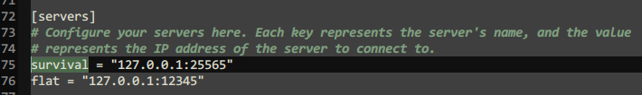

# Currently supported proxies:

<!-- Remember to replace the example links with the actual links -->
* Bungee - Install [Bans-Bungee](#) on your proxy and keep **Bans** on Bukkit servers.
* Velocity - Install [Bans-Velocity](#) on your proxy and keep **Bans** on Bukkit servers.

# Requirements

* MySQL database

# 1. Install Proxy Addons

Keep **Bans** on your Bukkit servers and install our addons on proxy from above.

# 2. Enable MySQL

We require a database connection to synchronize data between your network effectively.

a. Enable database in `settings.yml` inside plugins/Bans-Plugin folder. b. Enable network in `Settings.yml` inside plugins/Bans-Plugin folder. c. Change "Server_Name" in the section called `Proxy` to be unique for each server (see below).

# 3. Link Your Server Name

Ensure that your server name on proxy equals to the "Server_Name" key from step 2c.

Example for BungeeCord's config.yml:

Example for Velocity's velocity.toml:

# 4. Restart

After a restart, you should now be able to use proxy features automatically.

