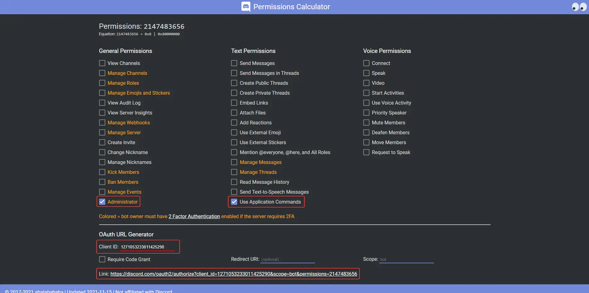
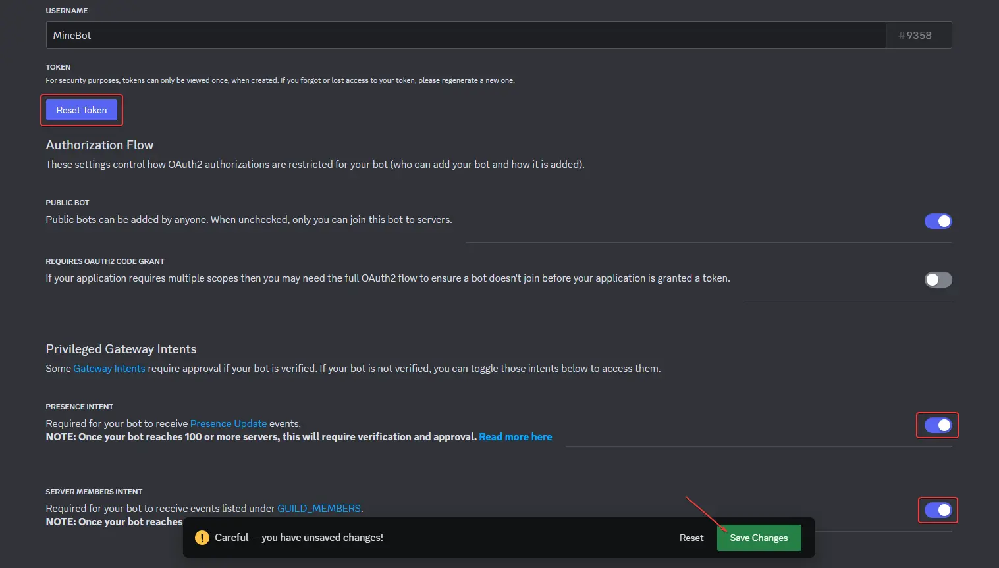

The first step to creating a Discord bot is to create a **bot user** on the developer portal. [Navigate to the developer portal](https://discord.com/developers/applications) and create a new bot:

!!! warning
    Before proceeding, ensure you have met all the necessary prerequisites. You can find detailed information on system requirements and dependencies [here](./requirements.md).

!!! danger
    Anyone with access to this token has **full access to your bot's account**, you should ensure that nobody has access to this token but you. Treat it like a username/password combination, but for bots.

-   :material-plus-circle:{ .lg .middle } **Create a New Application**

    ---

    <figure markdown>
      <figure markdown>
          { width=450 }
          <figcaption></figcaption>
      </figure>
    <figcaption>By creating an app you accept [Discord's Developer Terms of Service](https://discord.com/developers/docs/policies-and-agreements/developer-terms-of-service).</figcaption>
    </figure>

-   :material-robot:{ .lg .middle } **Navigate to the Information Tab**

    ---

    <figure markdown>
      <figure markdown>
          { width="450" }
          <figcaption></figcaption>
      <figure>
    <figcaption>Keep this application ID for the next step.</figcaption>
    </figure>

-   :fontawesome-solid-paper-plane:{ .lg .middle } **Invite Your Bot to Your Server**

    ---

    <figure markdown>
        <figure markdown>
            { width=450 }
            <figcaption></figcaption>
        </figure>
    <figcaption>Enter your application ID [here](https://discordapi.com/permissions.html#2147483656) and invite your bot to your server.</figcaption>
    </figure>

-   :material-robot:{ .lg .middle } **Navigate to the Bot Tab**

    ---

    <figure markdown>
      <figure markdown>
          { width="80" }
          <figcaption></figcaption>
      <figure>
    <figcaption>Access the bot settings in this tab.</figcaption>
    </figure>

-   :material-form-textbox-password:{ .lg .middle } **Create a New Token**

    ---

    <figure markdown>
        <figure markdown>
            { width=450 }
            <figcaption></figcaption>
        </figure>
    <figcaption>Generate a new token for your bot. Keep it secure and do not share it publicly.</figcaption>
    </figure>

-   :material-form-textbox-password:{ .lg .middle } **Write Your Token**

    ---

    <figure markdown>
        <figure markdown>
            { width=450 }
            <figcaption></figcaption>
        </figure>
    <figcaption>Write your token to your config file.</figcaption>
    </figure>

