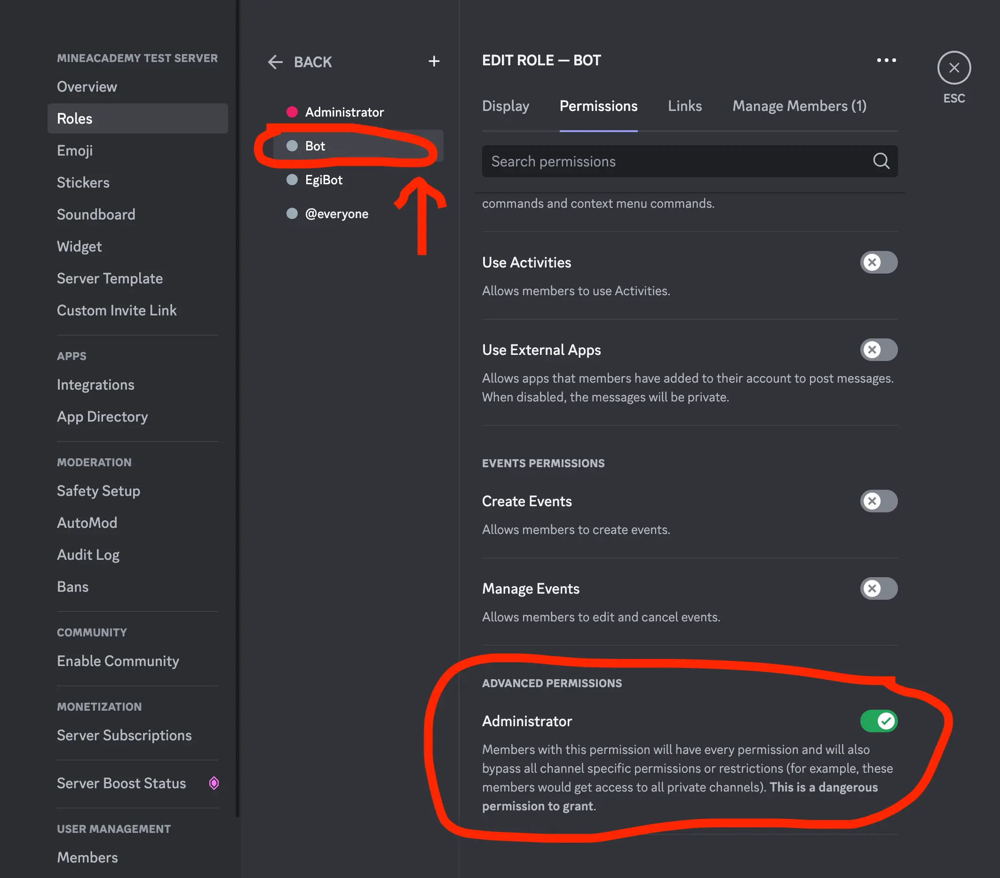
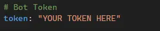

The first step to creating a Discord bot is to create a **bot user** on the developer portal. [Navigate to the developer portal](https://discord.com/developers/applications) and create a new bot:

!!! warning
    - Before proceeding, enable Discord Developer Mode by navigating to `Settings -> Advanced -> Developer Mode`.
    - Click the images below to zoom them.

!!! danger
    Anyone with access to this token has **full access to your bot's account**, you should ensure that nobody has access to this token but you. Treat it like a username/password combination, but for bots.

-   :material-plus-circle:{ .lg .middle } **1. Create A New Application**

    ---

    <figure markdown>
      <figure markdown>
          { width=450 }
          <figcaption></figcaption>
      </figure>
        <figcaption>Create an app at [Discord's Developer Portal](https://discord.com/developers/applications).</figcaption>
    </figure>

-   :material-robot:{ .lg .middle } **2. Copy Application Id**

    ---

    <figure markdown>
      <figure markdown>
          { width="450" }
          <figcaption></figcaption>
      <figure>
        <figcaption>In the General Information tab, copy the application ID for the next step.</figcaption>
    </figure>

-   :fontawesome-solid-paper-plane:{ .lg .middle } **3. Invite Bot To Your Server**

    ---

    <figure markdown>
        <figure markdown>
            { width=450 }
            <figcaption></figcaption>
        </figure>
        <figcaption>[Visit this website](https://discordapi.com/permissions.html#2147483656), ensure "Administrator" and "Use Application Commands" are checked and paste your Client ID from step 2 into "Client ID". Do not change any other options. Then click the "Link".   Invite the bot to your server and in the final screen, check all boxes to grant all of the permissions we've selected previously.</figcaption>
    </figure>

-   :fontawesome-solid-paper-plane:{ .lg .middle } **4. Set Permissions And Move Role To Top**

    ---

    <figure markdown>
        <figure markdown>
            { width=450 }
            <figcaption></figcaption>
        </figure>
        <figcaption>Drag the "bot" role to the top (it can be below other administrator roles) and ensure it's got the Administrator permission.</figcaption>
    </figure>

-   :material-robot:{ .lg .middle } **5. Navigate to the Bot Tab**

    ---

    <figure markdown>
      <figure markdown>
          { width="80" }
          <figcaption></figcaption>
      <figure>
        <figcaption>Access the bot settings in this tab.</figcaption>
    </figure>

-   :material-form-textbox-password:{ .lg .middle } **6. Create a New Token**

    ---

    <figure markdown>
        <figure markdown>
            { width=450 }
            <figcaption></figcaption>
        </figure>
        <figcaption>Generate a new token for your bot and keep it private.</figcaption>
    </figure>

-   :material-form-textbox-password:{ .lg .middle } **7. Give Privileged Intents**

    ---

    <figure markdown>
        <figure markdown>
            { width=450 }
            <figcaption></figcaption>
        </figure>
        <figcaption>Adjust 3 Privileged Gateway Intents as per the image above.</figcaption>
    </figure>

-   :material-form-textbox-password:{ .lg .middle } **8. Set Bot Token**

    ---

    <figure markdown>
        <figure markdown>
            { width=450 }
            <figcaption></figcaption>
        </figure>
        <figcaption>Write your token to your configuration/settings/config.yaml file .</figcaption>
    </figure>

-   :material-form-textbox-password:{ .lg .middle } **8. Set Your Guilt Id**

    ---

    <figure markdown>
        <figure markdown>
            { width=80 }
            <figcaption></figcaption>
        </figure>
        <figcaption>Copy the Discord server id (guild id) that you plan to use with MineBot.</figcaption>
    </figure>

-   :material-form-textbox-password:{ .lg .middle } **10. Paste Your Discord Servers ID**

    ---

    <figure markdown>
        <figure markdown>
            { width=450 }
            <figcaption></figcaption>
        </figure>
        <figcaption>Paste the Discord server guild ID that you copied in the same config file where you set the bot token in step 8.</figcaption>
    </figure>

-   :material-form-textbox-password:{ .lg .middle } **11. Done!**

    ---

    You're done! All other settings are optional. However, we highly recommend linking it with your Minecraft server to get the most functionality out of it in the "server" section of the same file from step 8 and 10.
     
    You can now either finish configuring the bot to your needs to launch your bot. 

    See the [:octicons-quote-16: Requirements](./requirements.md) on launching the bot.

